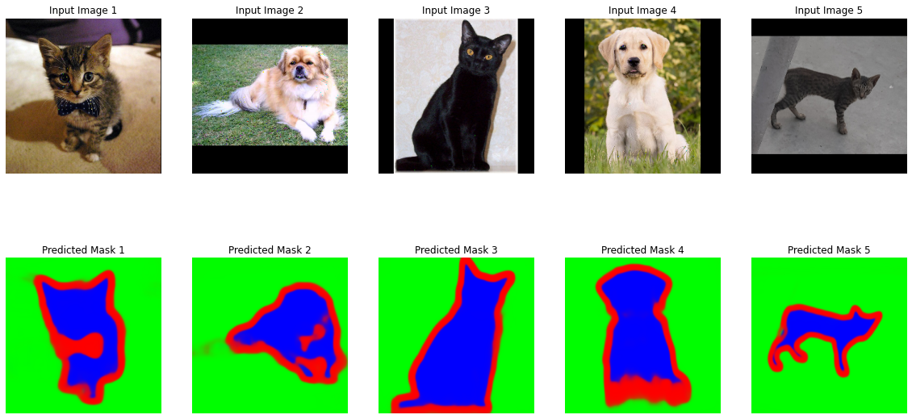

## Semantic Segmentation using U-Net
Semantic Segementation on Oxford-IIIT Pet Dataset using U-Net Architeture with Resnet-34 backbone.

### Demo
Download [Oxford-IIIT Pet Dataset](https://www.robots.ox.ac.uk/~vgg/data/pets/) and run `UNet_Resnet34.ipynb`
### Results:
